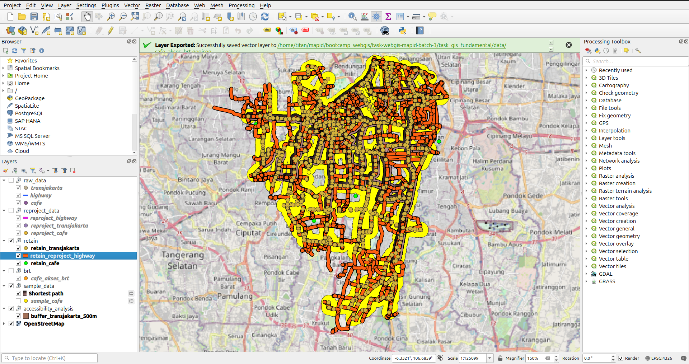
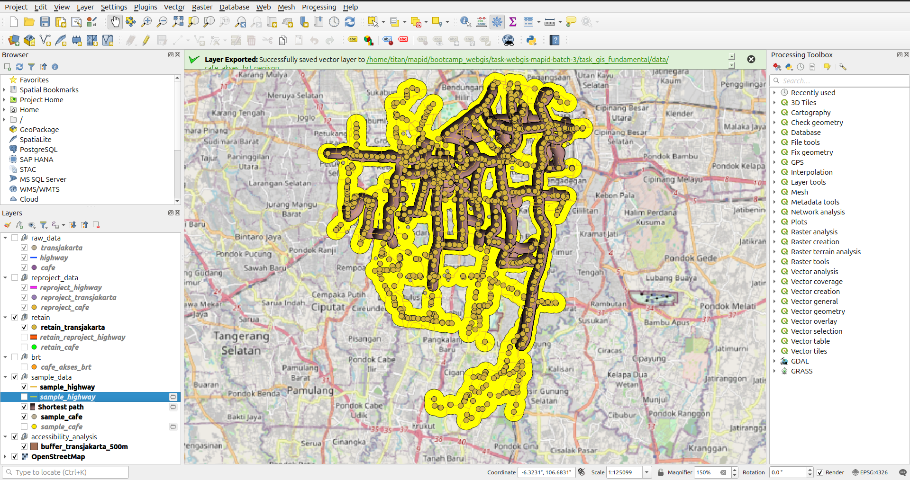
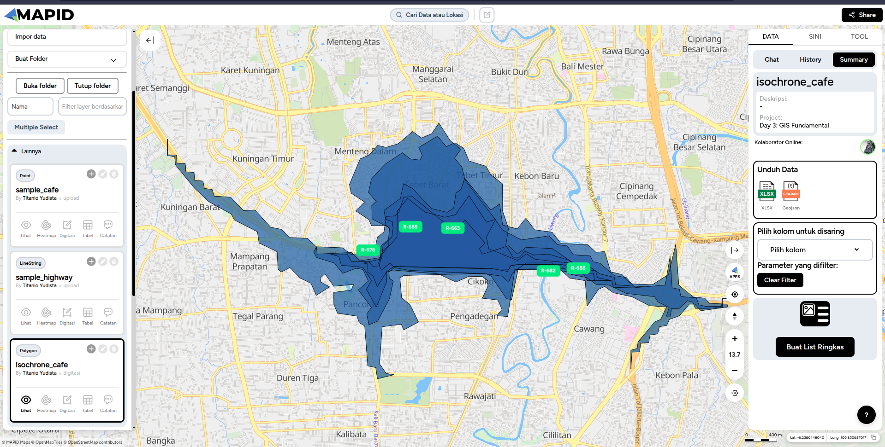

# Laporan Eksplorasi Data Spasial: Fasilitas Publik dan Aksesibilitas Transportasi

**Dibuat Oleh:** Titanio Yudista

**1. Judul Eksplorasi Data**  
Eksplorasi Data Spasial: Sebaran Cafe, Jaringan Jalan, dan Aksesibilitas Halte Transjakarta.

**2. Wilayah Studi yang Digunakan**  
Jakarta Selatan, DKI Jakarta.

**3. Sumber Data dan Jenis Data yang Digunakan**  
- **Sumber Data:** OpenStreetMap (OSM) diunduh melalui Overpass Turbo.  
- **Jenis Data:**  
  - **Cafe:** Titik lokasi cafe (`amenity=cafe`).  
  - **Halte Transjakarta:** Titik lokasi halte bus Transjakarta (`network=Transjakarta`, `operator=Transjakarta`, `amenity=bus_stop`).  
  - **Jaringan Jalan:** Garis jalan raya (`highway=primary|secondary|tertiary`).  
  - **Data Hasil Pengolahan:** Area buffer 500m dari halte Transjakarta (Poligon) dan Cafe yang berada dalam area akses transportasi.

**4. Informasi Dasar Data**  
- **Geometri:** Titik (Cafe, Halte), Garis/LineString (Jaringan Jalan), Poligon (Buffer Area/Isochrone).  
- **Atribut Utama:**  
  - Cafe: `name`, `amenity`  
  - Halte: `name`, `network`, `operator`  
  - Jalan: `name`, `highway`  
- **Sistem Koordinat (CRS):** WGS 84 (EPSG: 4326), karena data diekspor ke dalam format GeoJSON untuk kompatibilitas WebGIS.

**5. Alur Pengerjaan Secara Singkat**  
1. **Akuisisi Data:** Menggunakan Overpass Turbo dengan query wilayah "Jakarta Selatan" untuk mengunduh data titik Cafe, Halte Transjakarta, dan jaringan jalan. Data diekspor dalam format JSON.  
2. **Identifikasi Data di QGIS:** Data hasil unduhan dimasukkan ke dalam QGIS untuk dilakukan pengecekan struktur data, kelengkapan atribut, dan jenis geometri.  
3. **Transformasi Koordinat & Pengolahan Sederhana:** Melakukan reprojeksi CRS dari WGS 84 ke UTM Zone 48S (EPSG:32748) agar perhitungan jarak lebih akurat. Kemudian membuat layer *buffer* (500 meter) dari titik halte Transjakarta, serta menyeleksi (*spatial join/intersection*) cafe yang berada di radius aksesibilitas tersebut.  
4. **Digitasi Layer Baru (Sampel):** Melakukan digitasi dan pembuatan layer baru secara rapi dengan menyalin data titik cafe terpilih dan jaringan jalan ke dalam layer terpisah (`sample_cafe` dan `sample_highway`) sebagai sampel area pengamatan terfokus.  
5. **Plotting dan Styling:** Melakukan simbologi dengan mengatur warna ikon cafe, variasi ketebalan/warna jalan sesuai kelasnya (primary, secondary, tertiary), dan memberikan transparansi pada poligon buffer agar peta visual yang dihasilkan representatif, rapi, dan mudah dibaca.  
6. **Export ke GeoJSON:** Menyimpan layer hasil pengolahan dan digitasi ke format `.geojson` standar (seperti `cafe_akses_brt.geojson`, `sample_cafe.geojson`, `sample_highway.geojson`) menggunakan CRS WGS 84 (EPSG:4326) agar siap digunakan secara *out-of-the-box* sebagai data input WebGIS.  
7. **Uji Coba di Geo Mapid:** Mengunggah file `.geojson` tersebut ke *Geo Mapid Online Tools* dan mencoba fitur *Isochrone* untuk memvalidasi area layanan fasilitas di atas *basemap* interaktif.

**6. Peta Visualisasi**  

Berikut adalah tangkapan layar hasil visualisasi serta styling data di QGIS:

  
  

Berikut adalah tangkapan layar pengujian layer visualisasi dan Isochrone pada Geo Mapid Online Tools:

  

**7. Catatan Singkat Potensi Penggunaan Data untuk WebGIS**  
Data sebaran cafe, halte, dan jaringan jalan raya ini sangat potensial jika diintegrasikan ke dalam sebuah platform WebGIS:
- **Analisis *Transit-Oriented Development* (TOD):** WebGIS dapat menampilkan visualisasi interaktif mengenai seberapa mudah akses sarana komersil (cafe) dijangkau dengan berjalan kaki dari halte bus terdekat.  
- **Direktori Lokasi Interaktif:** Menampilkan peta sebaran cafe lengkap dengan *pop-up* informasi nama cafe dan rute jalannya bagi calon konsumen.  
- **Dashboard Analitik Tata Ruang:** Memberikan gambaran (*heatmap* atau visualisasi spasial) tentang distribusi kepadatan tempat usaha di Jakarta Selatan yang bisa dimanfaatkan bagi pengambil keputusan terkait perizinan, pengelolaan lalu lintas, hingga potensi investasi.
